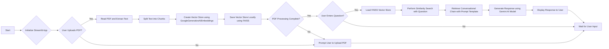

# chat_with_docs

```mermaid
graph LR
    A[Start] --> B{Initialize Streamlit App};
    B --> C{User Uploads PDF?};
    C -- Yes --> D[Read PDF and Extract Text];
    D --> E[Split Text into Chunks];
    E --> F[Create Vector Store using GoogleGenerativeAIEmbeddings];
    F --> G[Save Vector Store Locally using FAISS];
    G --> H{PDF Processing Complete?};
    H -- Yes --> I{User Enters Question?};
    I -- Yes --> J[Load FAISS Vector Store];
    J --> K[Perform Similarity Search with Question];
    K --> L[Retrieve Conversational Chain with Prompt Template];
    L --> M[Generate Response using Gemini AI Model];
    M --> N[Display Response to User];
    C -- No --> O[Prompt User to Upload PDF];
    I -- No --> P[Wait for User Input];
    H -- No --> O;
    N --> P;
    O --> P;
```
